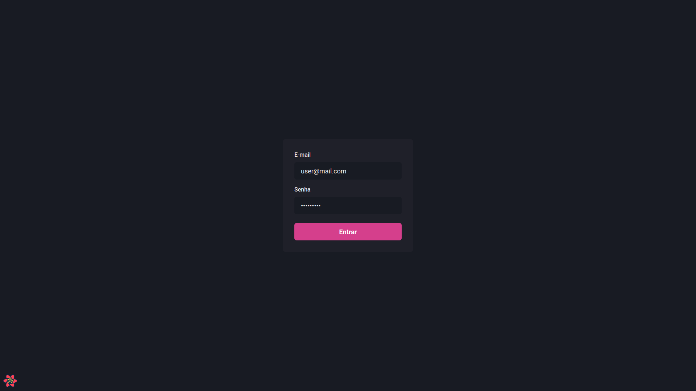
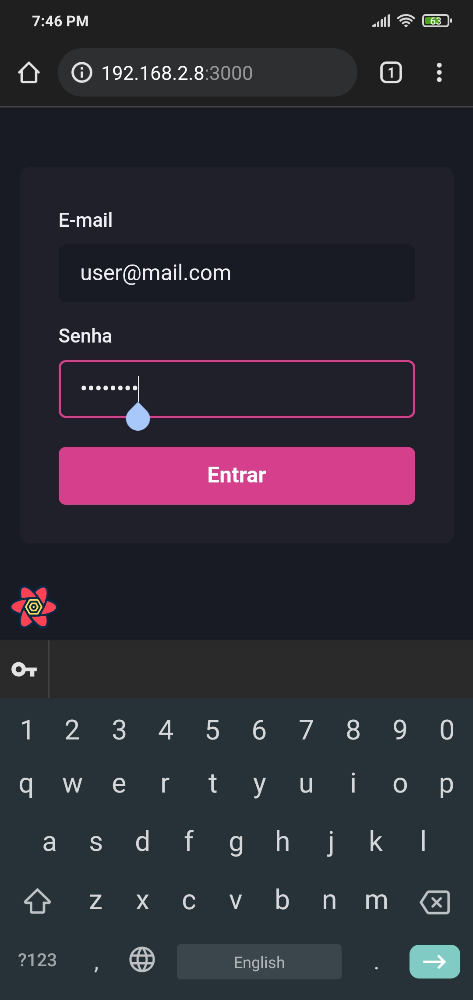
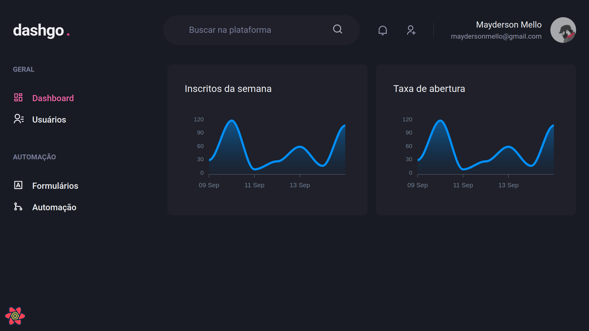
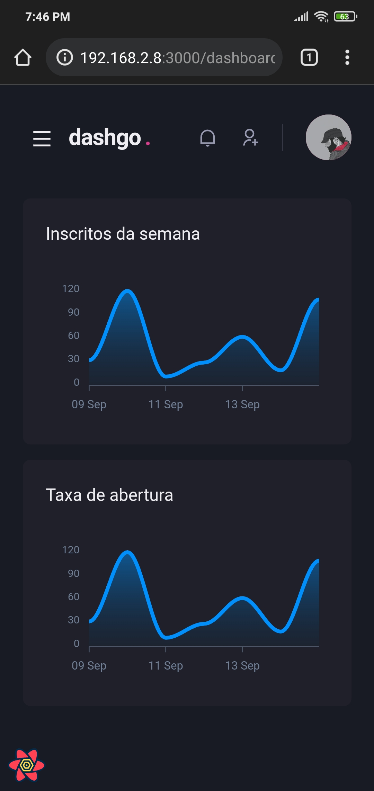
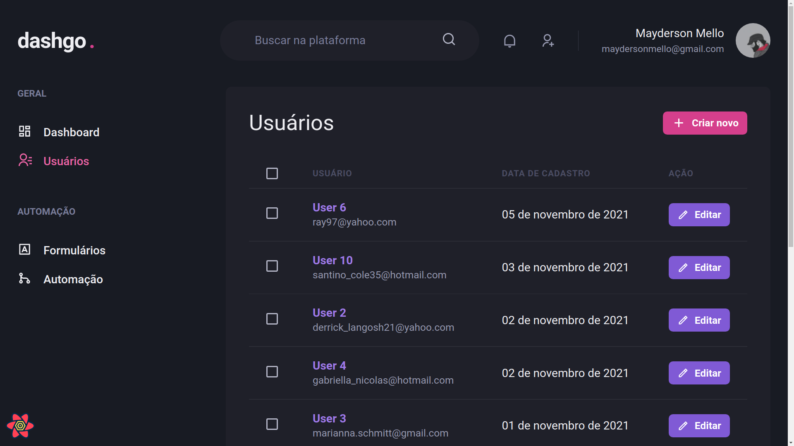
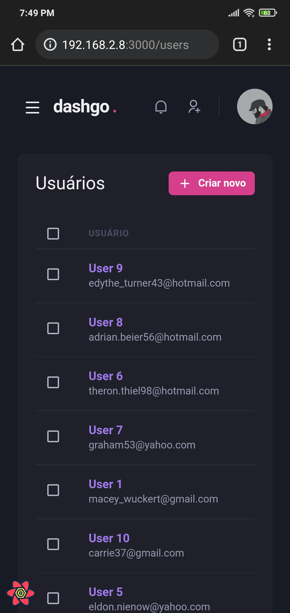
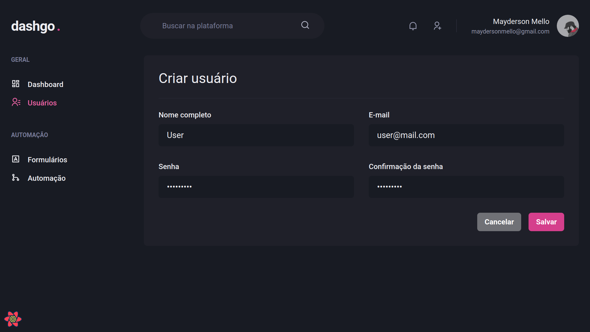
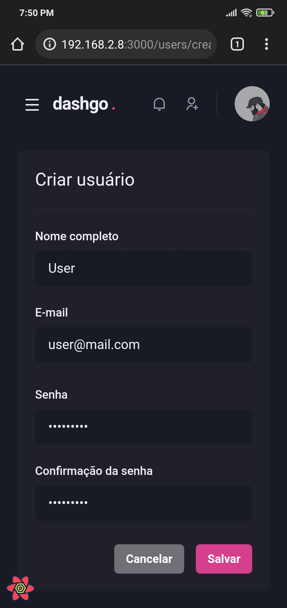

<h1 align="center">
  Dashgo
</h1>

<p align="center">
  
       
  
</p>

# Ignite Project
Dashgo is an example of a responsive dashboard created with Next.js and Chakra UI.

### Screens
<p align="left">
  
  
</p>

<p align="left">
  
  
</p>

<p align="left">
  
  
</p>

<p align="left">
  
  
</p>

## 🚀 Techs
→ [**Next.js**](https://nextjs.org)

→ [**TypeScript**](https://www.typescriptlang.org)

→ [**Chakra UI**](https://chakra-ui.com)

→ [**Apexcharts.js**](https://apexcharts.com)

→ [**React Hook Form**](https://react-hook-form.com)

→ [**Yup**](https://github.com/jquense/yup)

→ [**React Query**](https://react-query.tanstack.com)

→ [**Mirage JS**](https://miragejs.com)

→ [**Faker**](https://github.com/marak/Faker.js)

## 💻 Run project
```bash
# Open terminal and clone this repository
$ git clone https://github.com/Sup3r-Us3r/ignite-project-dashgo.git

# Install dependencies
$ npm install
# or
$ yarn install

# Start the application
$ npm run dev
# or
$ yarn dev
```
